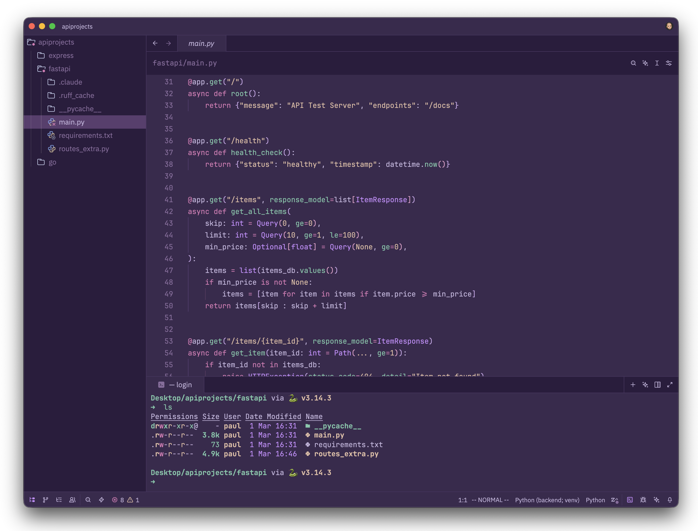

<h3 align="center">
 
BooBerry for <a href="https://github.com/zed-industries/zed">Zed</a>

</h3>

 
 
 

 

### Usage

1. Download the JSON file from the [`theme`](./theme/) directory.
2. Create the `themes/` subfolder inside the directory of your [Zed configuration file](https://zed.dev/docs/configuring-zed#settings-files) (typically `~/.config/zed/`).
3. Move the downloaded file from Step 1 to the `themes/` subfolder created in Step 2.
4. Restart Zed.
5. Enter _theme selector: toggle_ in the command palette and select your new flavor and accent combination theme in the dropdown.

&nbsp;

 Copyright &copy; 2026-present <a href="https://github.com/booberrytheme" target="_blank">BooBerrryTheme Org</a>

 

